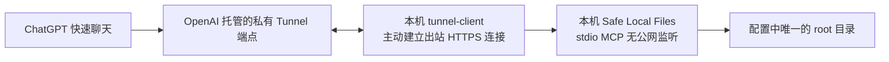
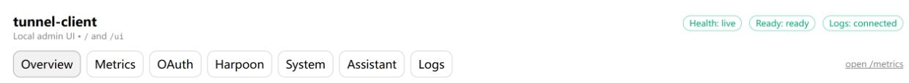
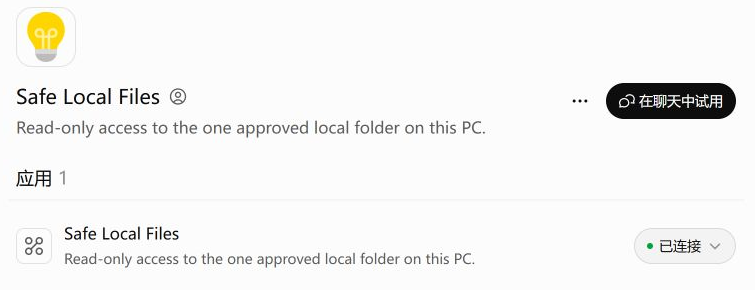
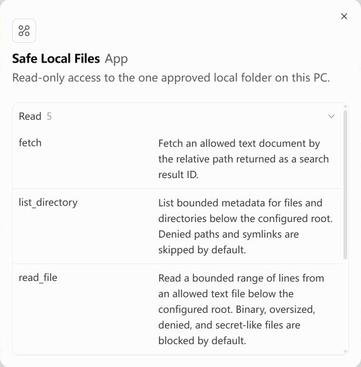
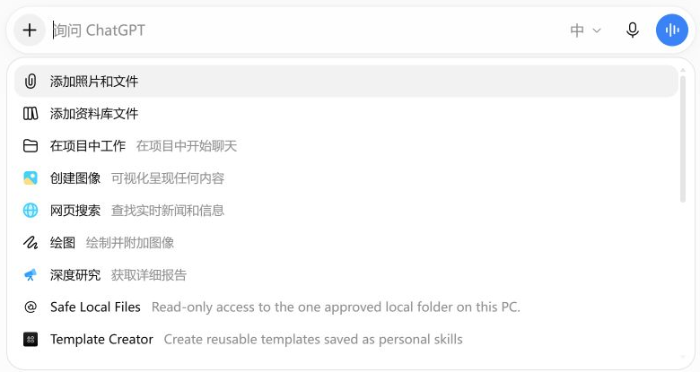

# 用 Safe Local Files 让 ChatGPT 快速聊天只读访问自己的文件夹

面向需要在 **ChatGPT 的“聊天”界面**查询自己电脑文件的同事。本文以 Safe Local Files v0.2.6 和 OpenAI Secure MCP Tunnel 为例，覆盖 Windows、macOS；Linux 可参照 macOS 的终端步骤。每个人在**存放文件的那台电脑**部署自己的服务、选择自己的目录，并使用自己的 OpenAI Platform 和 ChatGPT 账号建立连接。仓库不包含任何人的文件、私有配置或密钥。

本文完成后的验收标准：在新的 ChatGPT 聊天里选择说明为 **“Read-only access to the one approved local folder on this PC.”** 的 Safe Local Files，实际调用 `stat_path({"path":"."})` 得到 `directory`；随后可用 `list_directory({"path":".","depth":1})` 列出授权目录的顶层名称。仅在 Codex 里安装插件、看到插件名字，或看到 Tunnel 显示在线，都不能代替这项端到端测试。

## 一 原理和边界



`tunnel-client` 在本机主动连接 OpenAI，把 MCP 请求交给同机的 Safe Local Files，再把结果返回聊天。电脑不需要域名、路由器端口映射或对公网开放本地端口。`127.0.0.1` 只属于运行程序的那台电脑；给云端 ChatGPT 填一个本机 IP、改 `hosts` 文件，都不能让它直接进入你的电脑。[OpenAI Secure MCP Tunnel 官方说明](https://developers.openai.com/api/docs/guides/secure-mcp-tunnels)

Safe Local Files 只访问私有配置 `root` 指向的目录。路径参数 `.` 指根目录，其他路径均相对于它；默认拒绝目录穿越、符号链接、常见密钥文件，并限制响应大小、搜索范围、耗时和并发。**只读不等于数据永不离开电脑**：当你让聊天读取某个允许的文件时，文件的相应内容会作为工具结果经 Tunnel 返回到 ChatGPT。请只授权愿意用于该用途的专用目录，遵守公司数据政策，不把整个磁盘、用户主目录或生产密钥目录设为 `root`。审计日志记录工具、相对路径和结果，不记录密钥或文件内容。详细规则见仓库 [安全说明](../SECURITY.md)。

本文只使用私有 Tunnel。它适合本人或被关联工作区的私有使用和开发者模式测试，**不是公开插件上架方案**。同事要读自己的电脑，就必须在自己的电脑与账号上重复部署；不能共用示例中的连接或密钥。[官方限制](https://developers.openai.com/api/docs/guides/secure-mcp-tunnels)

## 二 准备事项

| 项目 | 要求 |
| --- | --- |
| 数据机器 | Windows 10/11、macOS 或 Linux；可以保持开机并访问外网 HTTPS |
| 本地软件 | Git、Go 1.25 或更新版本、Codex CLI；`tunnel-client` 从 OpenAI 官方 Release 下载 |
| 授权目录 | 本机已存在的绝对路径，建议先放少量不敏感的 `.txt` 或 `.md` 样例文件 |
| OpenAI 权限 | 能登录 Platform；创建 Tunnel 需 Tunnels Read + Manage，运行和在 ChatGPT 选择 Tunnel 需 Read + Use；Tunnel 要关联目标 ChatGPT 工作区 |
| ChatGPT 权限 | 可开启开发者模式；企业或教育工作区可能需要管理员先开放 |

GitHub 源码与安装说明：[safe-local-files-mcp](https://github.com/wangchuncheng18/safe-local-files-mcp)。截至本文使用的稳定包为 [v0.2.6](https://github.com/wangchuncheng18/safe-local-files-mcp/releases/tag/v0.2.6)。从源码安装时脚本会编译程序；不想安装 Go 的人可从 Releases 下载与系统和 CPU 架构匹配的包，并核对随包的 SHA-256 文件，再按仓库说明手动配置。以下主流程使用源码安装，便于交给本地 Codex 执行。

## 三 安装并指定自己的目录

### Windows

在 PowerShell 中运行：

```powershell
git clone https://github.com/wangchuncheng18/safe-local-files-mcp.git
cd safe-local-files-mcp
.\install.ps1
codex mcp get safe_local_files
```

安装器会编译、注册本地 Codex 插件和 `stdio` MCP，并在 `%LOCALAPPDATA%\SafeLocalFiles\config.json` 创建**本机私有配置**。用本机编辑器把其中的 `root` 改为你自己的绝对路径，例如 JSON 中的 `"root": "D:\\AI-Share"`。JSON 的反斜杠必须写两次。确认下列开关仍为 `false`：

```json
"write_permissions": {
  "enabled": false,
  "create_files": false,
  "overwrite_files": false,
  "create_directories": false
}
```

然后验证：

```powershell
.\plugins\safe-local-files\bin\safe-local-files.exe validate --config "$env:LOCALAPPDATA\SafeLocalFiles\config.json"
codex mcp get safe_local_files
```

`validate` 应报告根目录可访问；`codex mcp get` 应显示已启用的 `stdio` 连接。安装器可能创建一个只监听 `127.0.0.1` 的 HTTP 测试进程后立即停止；本文的快速聊天路线实际使用 `stdio`，**不依赖配置中的 HTTP 端口或 HTTP Token**。不要为了接入快速聊天而打开 `allow_remote`。

### macOS 与 Linux

在终端运行：

```sh
git clone https://github.com/wangchuncheng18/safe-local-files-mcp.git
cd safe-local-files-mcp
./install.sh
codex mcp get safe_local_files
```

私有配置位于 `${XDG_CONFIG_HOME:-$HOME/.config}/safe-local-files/config.json`。将 `root` 改为本机目录，例如 `/Users/alice/Documents/AI-Share` 或 `/home/alice/AI-Share`，保持上面的四个写权限开关全部为 `false`。保存后可运行：

```sh
DATA_DIR="${XDG_CONFIG_HOME:-$HOME/.config}/safe-local-files"
SAFE_LOCAL_FILES_TOKEN="$(cat "$DATA_DIR/token")" \
  ./plugins/safe-local-files/bin/safe-local-files validate \
  --config "$DATA_DIR/config.json"
codex mcp get safe_local_files
```

此时可在新的本地 Codex 任务中仅调用 `stat_path({"path":"."})`，确认是目录。**这一步只证明 Codex 的本地 MCP 可用；ChatGPT 快速聊天仍需下面的 Tunnel 和独立连接。**

## 四 创建自己的 OpenAI 私有 Tunnel

1. 登录 [OpenAI Platform Tunnel 设置](https://platform.openai.com/settings/organization/tunnels)。在自己的 Platform 组织创建 Tunnel，名称可用 `my-local-files`，把它关联到自己使用的 ChatGPT 工作区，记录页面显示的 `tunnel_id`。不要复制别人的 Tunnel ID。
2. 在 Platform 创建**专供运行**的 API Key，权限限于 Tunnels Read + Use，并按公司政策设置到期时间。创建或管理 Tunnel 的管理权限不要给长驻运行密钥。密钥只会在创建时显示，请在本机安全保存；不要贴进 ChatGPT、Codex 对话、Git 仓库、截图或命令行参数。过期或怀疑泄露时轮换。
3. 从 OpenAI 官方 [tunnel-client 最新 Release](https://github.com/openai/tunnel-client/releases/latest) 下载适合本机架构的包，用同一版本发布的 `SHA256SUMS.txt` 校验后安装。先运行 `tunnel-client help quickstart`；若版本升级后参数不同，以安装版本的帮助为准。

建议的运行密钥文件位置：Windows 用 `%LOCALAPPDATA%\SafeLocalFiles\openai-tunnel-api-key`，macOS/Linux 用 `${XDG_CONFIG_HOME:-$HOME/.config}/safe-local-files/openai-tunnel-api-key`。把密钥**在本机**保存到该文件，文件必须位于授权目录和 Git 仓库之外，且只允许当前用户读取。Windows 可对文件执行 `icacls <文件路径> /inheritance:r /grant:r <当前用户名>:R`；macOS/Linux 对父目录执行 `chmod 700`，对密钥文件执行 `chmod 600`。下面的命令只引用 `file:` 路径，不显示密钥值。

### Windows 启动示例

在克隆的仓库根目录打开 PowerShell。把 `<自己的 tunnel_id>` 改为自己的 ID；`tunnel-client.exe` 所在位置也要与实际安装位置一致：

```powershell
$client = "$env:LOCALAPPDATA\SafeLocalFiles\tools\tunnel-client.exe"
$mcp = (Resolve-Path .\plugins\safe-local-files\bin\safe-local-files.exe).Path.Replace('\', '/')
$cfg = "$env:LOCALAPPDATA\SafeLocalFiles\config.json".Replace('\', '/')
$key = "$env:LOCALAPPDATA\SafeLocalFiles\openai-tunnel-api-key"
$mcpCommand = '"{0}" stdio --config "{1}"' -f $mcp, $cfg
& $client runtimes connect --alias my-local-files --tunnel-id '<自己的 tunnel_id>' `
  --runtime-api-key "file:$key" --mcp-command $mcpCommand
& $client runtimes status my-local-files --json
```

Windows 的 `--mcp-command` 中使用正斜杠路径很重要；某些 `tunnel-client` 版本会按 shell 风格解析反斜杠，导致程序路径找不到。若浏览器能访问 OpenAI，而客户端访问 `api.openai.com:443` 超时，检查公司网络代理，只在本机运行进程中按实际代理地址设置 `HTTPS_PROXY` 和 `HTTP_PROXY`；不要把同事的代理端口照抄进配置。

### macOS 与 Linux 启动示例

在仓库根目录执行；先把 `tunnel-client` 安装到 `PATH`，将占位 Tunnel ID 换成自己的：

```sh
MCP_BIN="$(pwd)/plugins/safe-local-files/bin/safe-local-files"
CONFIG="${XDG_CONFIG_HOME:-$HOME/.config}/safe-local-files/config.json"
KEY_FILE="${XDG_CONFIG_HOME:-$HOME/.config}/safe-local-files/openai-tunnel-api-key"
tunnel-client runtimes connect --alias my-local-files \
  --tunnel-id '<自己的 tunnel_id>' \
  --runtime-api-key "file:$KEY_FILE" \
  --mcp-command "\"$MCP_BIN\" stdio --config \"$CONFIG\""
tunnel-client runtimes status my-local-files --json
```

只有状态显示 `healthy=true`、`ready=true` 且进程在运行时才进入下一步。`tunnel-client` 的本地 `/ui` 管理页也会显示 `Health: live`、`Ready: ready` 和连接日志；它的回环端口是运行时产生的，不要把截图中的端口照抄给同事。



*图 1：本机运行状态示例。图中的状态比单纯看到进程存在更有意义。*

## 五 在 ChatGPT 注册只读连接

1. 在 ChatGPT **设置 → 账户安全与登录** 开启开发者模式。若工作区没有该选项，请联系管理员核对策略。开发者模式会允许自建连接，只添加自己信任的服务。[官方接入步骤](https://developers.openai.com/plugins/deploy/connect-chatgpt)
2. 打开 [ChatGPT 插件页面](https://chatgpt.com/plugins)，点 **添加插件 → 创建应用 → 创建 MCP 应用**。填写名称（例如 `My Local Files`）和清楚的只读描述。在 **Connection** 选择 **Tunnel**，选刚才自己的 Tunnel，或填它的 `tunnel_id`。
3. 本项目的 `stdio` 服务没有单独的用户登录流程，因此这条 ChatGPT 连接选 **无身份验证**；Tunnel 的 Runtime API Key 已由本机 `tunnel-client` 使用，**不要再把它填进 ChatGPT 表单**。按页面要求确认自建连接风险，然后创建。
4. 创建后检查连接为“已连接”，工具发现只列出 `fetch`、`list_directory`、`read_file`、`search`、`stat_path` 五个读取工具，**不得出现** `write_file` 或 `create_directory`。若工具元数据升级，先重启服务、在插件页面点“刷新”，再新建聊天复测。[官方刷新步骤](https://developers.openai.com/plugins/deploy/connect-chatgpt)



*图 2：成功连接示例。你的插件名称可以不同；应核对只读描述与“已连接”状态。*



*图 3：工具详情示例。截图显示读取工具；实际检查时应继续滚动确认完整列表及没有写工具。*

## 六 在快速聊天中实际验收

新建 ChatGPT **聊天**（界面顶部选择“聊天”），点输入框的 `+`，选择刚创建的只读 Safe Local Files。若你同时在 Codex 安装了本地插件，可能看到两个同名项：说明为 **“Read-only access to the one approved local folder on this PC.”** 的连接才是本文的 ChatGPT Tunnel 连接；描述中含 “optionally write text” 的是本地 Codex 插件，不应靠名称猜测。



*图 4：从聊天加号菜单选择只读连接。示例账号的其他菜单项与你的账号可能不同。*

先发送：

> 请调用 Safe Local Files 的 `stat_path({"path":"."})`，只告诉我授权根目录是不是目录，不列文件、不读内容。

展开回复中的工具调用详情，核对请求确实是 `Stat path`、参数为 `{"path":"."}`，返回类型为 `directory`。然后在**仅含样例文件的目录**试：

> 请调用 `list_directory({"path":".","depth":1,"limit":100})`，只列顶层名称和文件或文件夹类型，不递归、不读取文件内容。

如果目录里有条目，应与本机看到的允许条目一致；被拒绝的路径与符号链接可能被安全规则隐藏。Windows 审计日志在 `%LOCALAPPDATA%\SafeLocalFiles\audit.jsonl`，macOS/Linux 在 `${XDG_CONFIG_HOME:-$HOME/.config}/safe-local-files/audit.jsonl`。应看到相应的 `stat_path` 或 `list_directory` 成功记录。**不要**把实际目录列表、日志或密钥发到公开 Issue。

## 七 重启 更新与排障

电脑关机、休眠、网络断开或 `tunnel-client` 停止时，云端聊天暂时无法读取本机。重启后先按第四节相同的 `runtimes connect` 命令恢复，再运行 `runtimes status my-local-files --json`；不要假定 ChatGPT 插件显示“已连接”就意味着本机进程仍在线。停止本机客户端可用 `tunnel-client runtimes stop my-local-files`，这不会删除 Platform 上的 Tunnel。

| 症状 | 先检查什么 |
| --- | --- |
| ChatGPT 看不到 Tunnel | 是否关联了当前 ChatGPT 工作区；账号是否具备 Tunnels Read + Use；是否开启开发者模式 |
| 能看到插件但调用失败 | `runtimes status` 的 `healthy`、`ready`、进程状态；必要时运行 `tunnel-client doctor --profile my-local-files --explain` |
| 返回的根目录不是预期目录 | 私有 `config.json` 的 `root` 是否改为自己电脑的绝对路径；修改后重启本地连接 |
| 明明有顶层文件却返回空列表 | 确认使用 Safe Local Files **v0.2.6 或更新版本**；旧版曾有顶层深度计算错误；还应检查拒绝规则与符号链接 |
| Windows 提示 MCP 程序路径不存在 | 检查 `--mcp-command` 中的路径已转为正斜杠、程序文件仍在原位置 |
| 浏览器能上网但客户端超时 | 检查到 `api.openai.com:443` 的出站网络、公司代理与客户端进程继承的环境变量 |
| 只想查看，工具却出现写入项 | 立即停止连接，检查 `write_permissions` 四项均为 `false`，重启并刷新工具元数据 |

本流程不会自动为每位同事配置开机自启。需要长期在线时，应按所在公司终端管理策略部署受控的用户级启动任务，并使密钥文件、代理和日志权限持续有效。不要把运行密钥放进启动命令文本。

## 八 交给本地 Codex 的安装任务文本

将下面文字复制给**运行在自己电脑上的 Codex**，先替换方括号里的系统和目录。不要把密码或 API Key 填入这段文字；登录与一次性密钥保存由本人在本机完成。

> 请阅读 https://github.com/wangchuncheng18/safe-local-files-mcp 的 README.md、INSTALL_FOR_AGENTS.md、SECURE_TUNNEL.md 和 docs/快速聊天本地文件只读接入指南.md，在这台 [Windows/macOS/Linux] 电脑安装 Safe Local Files v0.2.6 或更新版本。唯一授权目录是 [我自己电脑上已存在的绝对路径]。始终保持写权限关闭，先验证本机 `stat_path(".")`。然后从 OpenAI 官方 Release 安装并校验 tunnel-client，协助我在自己的 Platform 组织创建和关联私有 Tunnel，以及限制为 Tunnels Read + Use 的运行密钥。让我亲自在本机安全保存密钥，不要把密钥值输出、记录在聊天或提交 Git。用 `file:` 引用密钥文件，通过 `stdio` 连接本机服务，验证 runtime 健康和就绪。在我的 ChatGPT 开发者模式创建 Tunnel 类型、无独立身份验证的只读 MCP 连接；在新“聊天”中实际调用 `stat_path({"path":"."})`，最后只对样例目录调用一次 `list_directory({"path":".","depth":1})`。若缺少账号权限或网络条件，请具体说明；未看到真实工具调用前不要宣称完成。

更多实现与维护说明：[README](../README.md)、[给 AI 的安装清单](../INSTALL_FOR_AGENTS.md)、[私有 Tunnel 指南](../SECURE_TUNNEL.md)、[OpenAI Tunnel 官方文档](https://developers.openai.com/api/docs/guides/secure-mcp-tunnels)、[ChatGPT 插件接入官方文档](https://developers.openai.com/plugins/deploy/connect-chatgpt)。界面截图取自一次已连接的示例环境，产品界面和权限名称可能随版本变化；以自己账号页面和已安装客户端的帮助信息为准。
